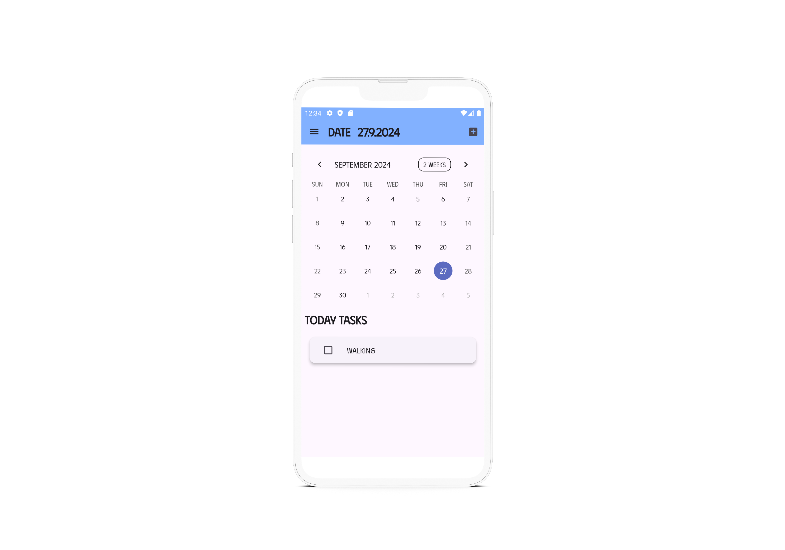

# Task App with Calendar Feature

This is a Flutter-based task management application that allows users to schedule and track tasks through a calendar interface. The app uses the Hive database for offline storage.

## Features

- **Task Management**: Add, edit, and delete tasks.
- **Calendar View**: Visual representation of tasks on a calendar.
- **Hive Database**: Local storage for efficient task management.
- **User Interface**: Custom UI components for seamless user experience.


## Preview



## Project Structure

```bash
├── lib
│   ├── features
│   │   ├── task
│   │   │   ├── task_bloc.dart      # Business logic for managing tasks
│   │   │   ├── task_repository.dart # Repository for task operations
│   │   │   └── task_service.dart    # Services related to task management
│   ├── models
│   │   ├── task_model.dart          # Model for Task object
│   │   └── task_model_g.dart      
│   ├── screens
│   │   ├── home_screen.dart         # Main screen with task list and calendar
│   │   ├── task_detail_screen.dart  # Screen for viewing task details
│   │   └── calendar_screen.dart     # Calendar view screen
│   ├── widgets
│   │   ├── task_card.dart           # UI component for individual task card
│   │   └── calendar_widget.dart     # UI component for the calendar
│   └── main.dart                    # Entry point of the application
├── pubspec.yaml                      # Project dependencies
└── hive_boxes                        # Folder containing Hive database boxes


